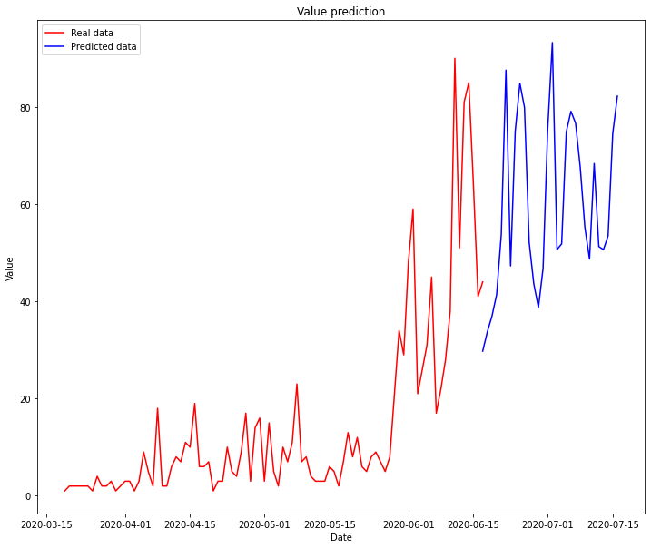

# COVID predictor


RNN implementation to predict the number of COVID-19 cases.


## Requirements

#### 1.- Install virtual environment

To run the RNN implementation, it's recommended to create and activate a virtual enviroment if you don't have one already:

```bash
conda create --name covidpredictor python=3.7
conda activate covidpredictor
```

#### 2.- Install the dependencies

Install Keras using conda:

```bash
conda install -c conda-forge keras
```

To generate the test datasets, install scrapy `pip`:

```bash
pip install -r requirements.txt
```

#### 3.- Update the datasets (optional)

The dataset is generated by scraping data from wikipedia, to run the scraper:

```bash
cd scraper/
scrapy crawl wikipedia
```

To generate the test datasets, install scrapy pip:

```bash
pip install -r requirements.txt
```

## Usage

The code is provided in both `.py` and `.ipynb` formats. Run the `.py` like any other python script:

```bash
python covid-predictor.py
```

To run the `.ipynb` notebook, just run jupiter:

```bash
jupyter notebook
```

The implementation expects the dataset to be in a formated .csv file with 2 columns:

- first column is the date (by default in `%Y-%m-%d` format)
- 2nd column is the value (integer)

The code has a lot of datasets in `/csv` to test; all of them in the format: `{state}-{category}.csv`.

The scraper retrieved 9 states (all from Bolivia where I live) and 3 categories (cases, deaths and recovers).

Once the script is ran, it should plot the current values alongsides the predicted ones:




### Final considerations

- Since the dataset is still very small, the predictions are not very good. Atthe number of entries increase, also the accuracy of the predictions.
- It would be nice to have an external service thatn provide datasets for any city. That way we won't need the scraper (which only works for the Bolivia page in wikipedia).
